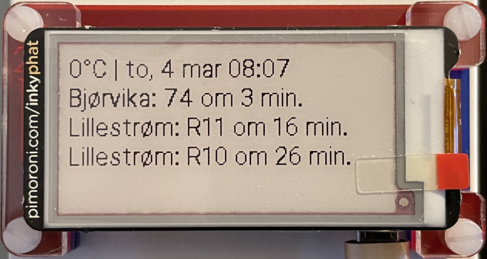

# Dodo Boy

Dodo Boy is a small script for displaying your local weather and schedules for
your public transportation routes.



## Hardware

- [Raspberry Pi Zero W](https://www.raspberrypi.org/products/raspberry-pi-zero-w/)
- [Inky pHAT](https://shop.pimoroni.com/products/inky-phat?variant-12549254217811)
- [Pibow Zero W](https://shop.pimoroni.com/products/pibow-zero-w)

## Software

- [Arrow](https://github.com/arrow-py/arrow)
- [Inky](https://github.com/pimoroni/inky)
- [Pillow](https://python-pillow.org/)
- [Python](https://www.python.org/) 3.7+
- [Raspberry Pi OS Lite](https://www.raspberrypi.org/software/operating-systems/#raspberry-pi-os-32-bit)

## Services

- [Entur Journey Planner](https://developer.entur.org/pages-journeyplanner-journeyplanner-v2)
- [MET Norway Weather API](https://api.met.no/)

## Install

Clone dodo-boy:

```sh
git clone https://github.com/tido64/dodo-boy.git
```

Install Dodo Boy on your Raspberry Pi:

```sh
cd dodo-boy
./py install
```

Then open `config.json` and configure it.

## Configuration

```json
{
  "locale": "nb_no",
  "dateFormat": "ddd, D MMM HH:mm",
  "home": {
    "lat": 59.90706253051758,
    "lon": 10.760673522949219
  },
  "trips": [
    {
      "destination": {
        "place": "NSR:StopPlace:337",
        "name": "Oslo S"
      },
      "entries": 2
    },
    {
      "destination": {
        "place": "NSR:StopPlace:4489",
        "name": "Lillestrøm bussterminal"
      },
      "entries": 2
    }
  ],
  "inky": {
    "type": "phat",
    "colour": "black"
  }
}
```

### `locale`

You can find a list of available locales and their names in the
[Arrow documentation](https://arrow.readthedocs.io/en/stable/#module-arrow.locales).

### `dateFormat`

The date can be formatted using the following tokens:

|                                | Token        | Output                                    |
|:-------------------------------|:-------------|:------------------------------------------|
| **Year**                       | YYYY         | 2000, 2001, 2002 ... 2012, 2013           |
|                                | YY           | 00, 01, 02 ... 12, 13                     |
| **Month**                      | MMMM         | January, February, March ...              |
|                                | MMM          | Jan, Feb, Mar ...                         |
|                                | MM           | 01, 02, 03 ... 11, 12                     |
|                                | M            | 1, 2, 3 ... 11, 12                        |
| **Day of Year**                | DDDD         | 001, 002, 003 ... 364, 365                |
|                                | DDD          | 1, 2, 3 ... 364, 365                      |
| **Day of Month**               | DD           | 01, 02, 03 ... 30, 31                     |
|                                | D            | 1, 2, 3 ... 30, 31                        |
|                                | Do           | 1st, 2nd, 3rd ... 30th, 31st              |
| **Day of Week**                | dddd         | Monday, Tuesday, Wednesday ...            |
|                                | ddd          | Mon, Tue, Wed ...                         |
|                                | d            | 1, 2, 3 ... 6, 7                          |
| **ISO week date**              | W            | 2011-W05-4, 2019-W17                      |
| **Hour**                       | HH           | 00, 01, 02 ... 23, 24                     |
|                                | H            | 0, 1, 2 ... 23, 24                        |
|                                | hh           | 01, 02, 03 ... 11, 12                     |
|                                | h            | 1, 2, 3 ... 11, 12                        |
| **AM / PM**                    | A            | AM, PM, am, pm                            |
|                                | a            | am, pm                                    |
| **Minute**                     | mm           | 00, 01, 02 ... 58, 59                     |
|                                | m            | 0, 1, 2 ... 58, 59                        |
| **Second**                     | ss           | 00, 01, 02 ... 58, 59                     |
|                                | s            | 0, 1, 2 ... 58, 59                        |
| **Sub-second**                 | S...         | 0, 02, 003, 000006, 123123123123...       |
| **Timezone**                   | ZZZ          | Asia/Baku, Europe/Warsaw, GMT ...         |
|                                | ZZ           | -07:00, -06:00 ... +06:00, +07:00, +08, Z |
|                                | Z            | -0700, -0600 ... +0600, +0700, +08, Z     |
| **Seconds Timestamp**          | X            | 1381685817, 1381685817.915482 ...         |
| **ms or µs Timestamp**         | x            | 1569980330813, 1569980330813221           |

See also [Arrow Supported Tokens](https://arrow.readthedocs.io/en/stable/#supported-tokens).

### `home`

The coordinates are used to fetch the local weather and public transport routes.

- **Apple Maps:** Right-click to drop a pin, then click on it to find the
  coordinates.
- **Google Maps:** Right-click anywhere on the map to reveal the coordinates.

### `trips`

Set up destinations you'd like to get routes for. To find transport stop
identifiers, use the [National Stop Register](https://stoppested.entur.org/).
Log in with guest/guest.

### `inky`

Configures your Inky pHAT e-ink display. Valid values for the `colour` property
include `red`, `yellow` or `black`.

## Power Savings

### Raspberry Pi Zero

Add the following lines to `/etc/rc.local` to disable HDMI and the LED:

```sh
# Disable HDMI
/usr/bin/tvservice -o

# Set the ACT LED trigger to 'none'
echo none | sudo tee /sys/class/leds/led0/trigger

# Turn off the ACT LED
echo 0 | sudo tee /sys/class/leds/led0/brightness
```

Alternatively, the LED can also be disabled in `/boot/config.txt`:

```ini
 # Disable the ACT LED
dtparam=act_led_trigger=none
dtparam=act_led_activelow=on
```

Disable the on-board Bluetooth in `/boot/config.txt`:

```ini
# Disable Bluetooth
dtoverlay=disable-bt
```

And uninstall BlueZ:

```sh
sudo apt purge --yes bluez
sudo apt autoremove --yes
```

## Contributing

A Python virtual environment is used for development purposes. The script, `py`,
takes care of setting up the environment and ensures things are run within it.
You can find all available commands by typing `./py help`.

```
usage: ./py [COMMAND]

Commands:
  check      Run linters and type checking
  ci         Simulate a full CI loop
  format     Format all Python files
  help       Show this help message and exit
  install    Install Dodo Boy on this device
  run        Run Dodo Boy
  test       Run tests
```
